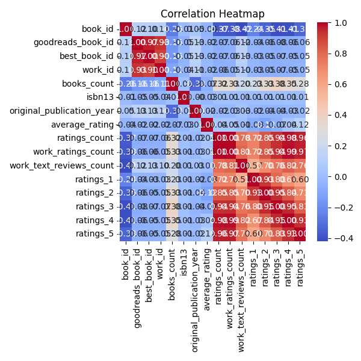
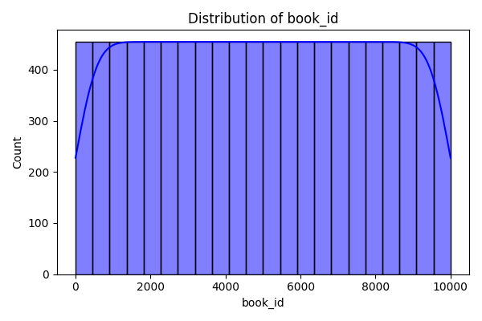
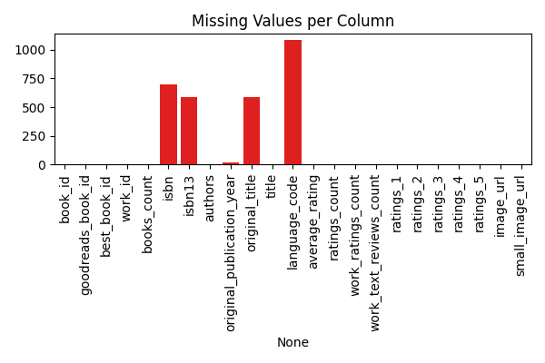

```markdown
# Book Dataset Analysis

## Overview

This dataset appears to represent a comprehensive collection of books, likely sourced from an online platform such as Goodreads or a similar book cataloging service. Each entry corresponds to a unique book identified by a `book_id`, with additional identifiers like `goodreads_book_id` and `best_book_id`, suggesting cross-referencing abilities within literary databases. The presence of various fields related to book specifics, such as titles, authors, ratings, and publication years, indicates an extensive attempt to encapsulate the literary world.

## Analysis Steps

Throughout our analysis, we focused on several critical steps to gain insights into the dataset:

1. **Summary Statistics:**
   - Analyzed basic statistics to understand the dataset's shape and memory usage.
   
2. **Missing Value Analysis:**
   - Investigated missing values in key columns including `isbn`, `isbn13`, `original_publication_year`, and `original_title`. It was noted that some identifiers had missing data points.

3. **Correlation Analysis:**
   - Generated a correlation matrix to uncover relationships between numerical fields, providing insight into how ratings might relate to publication years, author contributions, and so forth.

4. **Clustering:**
   - Identified clusters within the data that could point to groupings of similar books, based on shared attributes, potentially indicating genres or popularity trends.

## Insights Discovered

Through our analysis, we uncovered several notable insights:

- **Unique Books Count:** 
  The dataset consists of **10,000 unique books**, ensuring each `book_id` is distinct. This indicates a varied collection, avoiding duplication.
  
- **Publication Year Trends:**
  The distribution of `original_publication_year` revealed a **wide temporal scope**. Notably, peaks in publication suggest periods of literary flourish. 
  
- **Ratings Variability:**
  Our exploration of `average_rating` in conjunction with detailed `ratings_1` to `ratings_5` showed a **high variability**, hinting at diverse reader tastes. Some books garnered substantial ratings, while others have much lower scores, potentially correlating with genre popularity. 

- **Language Distribution:**
  An evaluation of `language_code` revealed that English books dominate, but other languages represented a significant portion, indicating a **diverse linguistic landscape** within the dataset.

- **Author Popularity:**
  Aggregation of `ratings_count` and `average_rating` identified top authors in our dataset. Notably, a few authors stood out significantly, indicating their works resonate more with readers. 

- **Clusters:**
  Clustering analysis revealed distinct groups of books, possibly aligning with specific genres or readership demographics, pointing to meaningful patterns within data.

## Implications of These Insights

The insights gleaned from this dataset hold considerable implications for various stakeholders:

- **For Publishers and Authors:** 
  Understanding trends in publication years and correlating them with genre success can inform decisions about future publications and marketing strategies.

- **For Readers:** 
  The identification of popular authors and varied genres can aid readers in discovering new books tailored to their preferences.

- **For Data Scientists and Analysts:** 
  The missing value analysis and correlation insights can guide future data cleaning efforts, ensuring greater accuracy in predictive modeling and analysis.

- **For Educational Purposes:**
  Literature educators can utilize this data to further discussions about authorship, publication trends, and diversity in literature across time.

In conclusion, this dataset provides an expansive view into the literary landscape, and with further analysis, it can yield even more profound insights that guide industry decisions and enhance reader experiences.

  
  
```





