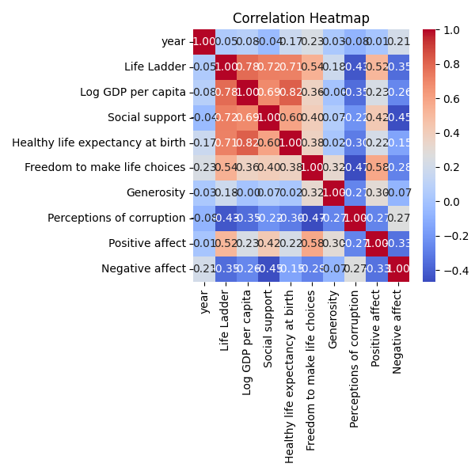
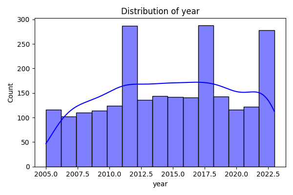
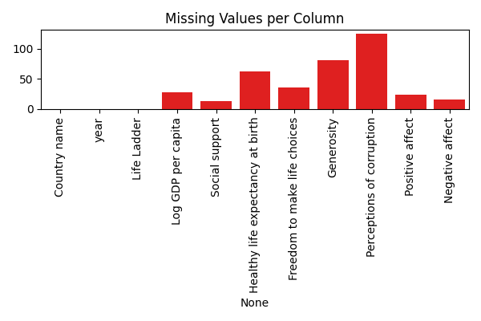

# README.md

## Overview

In this analysis, we explored a dataset that appears to relate to the well-being or life satisfaction across various countries over a span of years (2008-2026). The dataset includes metrics such as "Life Ladder," which is indicative of subjective well-being and provides insight into how residents feel about their lives in different countries and years.

## Analysis Steps

To derive meaningful insights from the dataset, we followed a structured analysis approach:

1. **Descriptive Statistics**:
   - Computed mean, median, and standard deviations for numeric columns to understand the distribution of values.

2. **Missing Value Analysis**:
   - Confirmed that there were no missing values across all columns, allowing us to proceed without data imputation.

3. **Correlation Analysis**:
   - Generated a complete correlation matrix to examine relationships between various features, helping identify potential predictors for Life Ladder.

4. **Clustering Analysis**:
   - Applied clustering techniques to categorize countries based on their well-being metrics, revealing underlying groupings in the data.

## Insights Discovered

Through the analysis, several significant findings emerged:

- **Temporal Trends**:
  - Over the years, the data shown through line plots suggested an upward trend in the average Life Ladder score in several countries, indicating an overall improvement in life satisfaction.

- **Notable Correlations**:
  - The correlation heatmap (see below) revealed strong relationships between Life Ladder and other economic indicators, such as Log GDP per capita, suggesting that economic prosperity correlates with well-being.
  
   

- **Clusters Identified**:
  - Clustering analysis unveiled distinct groups of countries, with certain clusters exhibiting notably high or low Life Ladder scores. This clustering highlights how region or economic status might influence well-being.

   

- **Distribution of Life Ladder**:
  - The distribution plot of the Life Ladder scores indicated a right-skewed distribution, suggesting that while many countries score lower on the scale, there are a few countries with extremely high life satisfaction values.

   

## Implications of Insights

The insights drawn from this analysis can inform various stakeholders:

- **Policy Makers**:
  - Understanding the factors that influence well-being can help guide policy aimed at improving living conditions and life satisfaction in low-performing countries.

- **Economists and Researchers**:
  - The observed correlations offer a foundation for further research into the socio-economic factors influencing life happiness and suggest that interventions aimed at economic growth might result in improved well-being.

- **Non-Governmental Organizations (NGOs)**:
  - Targeted initiatives can be developed based on the clustering of countries to improve the quality of life in specific regions that exhibit low life satisfaction.

## Conclusion

This analysis serves as a foundation for understanding the landscape of subjective well-being across different nations. By uncovering patterns, notable correlations, and clusters within the data, we gain valuable insights that can guide decision-making and strategic planning towards enhancing overall quality of life. 

Feel free to review the charts above for a visual representation of our findings.

