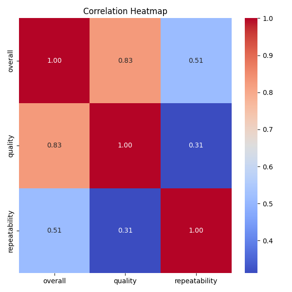
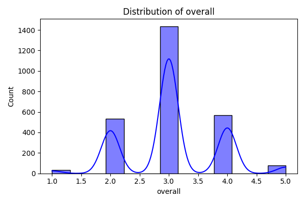
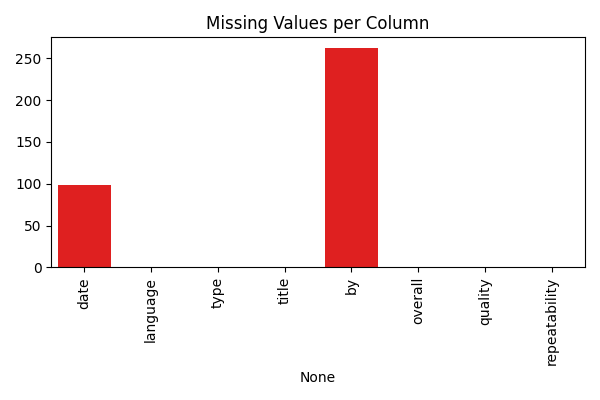

```markdown
# Content Dataset Analysis README

## Overview of the Dataset
The dataset likely represents a collection of media titles across various languages, types, and genres, possibly for a streaming platform or media review site. It includes information regarding user ratings, content types (e.g., movies, series), and languages, aiming to provide insights into user engagement and content popularity.

## Analysis Steps Performed
We undertook a series of systematic analyses to better understand the dataset:

1. **Summary Statistics:**
   - We assessed the general structure, including the dimensions, memory usage, and unique values in each column.
   
2. **Missing Values:**
   - We identified columns with missing values, specifically noting 99 null entries in the "date" column and 262 null entries in the "by" column.

3. **Correlation Analysis:**
   - A correlation matrix was generated to explore relationships between numerical columns, helping us identify any notable correlations among ratings.
   - 

4. **Clustering:**
   - Clustering techniques were applied to reveal distinct groupings within the dataset, potentially indicating different user preferences or content categories.

## Insights Discovered
Through our analysis, several key insights emerged:

- **Language Diversity:** The dataset comprises titles in **11 unique languages**, suggesting a rich array of content that caters to a diverse audience.
  
- **Content Variety:** With **8 different content types** (movies, series, TV series, etc.), the dataset likely appeals to various viewer preferences.

- **Title Uniqueness:** There are **2312 unique titles** present, which enriches the dataset but also requires careful consideration for potential duplicates.

- **User Engagement:** The low number of unique ratings across "overall," "quality," and "repeatability" suggests a potential engagement issue, where users may not be providing comprehensive feedback.
  
- **Missing Data Effects:** The significant number of missing values in the "by" column may limit insights into contributor performance and influence our analyses on high-rated content.

## Implications of Insights
The implications of our findings could guide several actionable steps:

- **Data Cleaning:**
  - It is crucial to handle missing values adequately; strategies could include imputation techniques for the "date" column and exploring methods to fill gaps in the "by" column.

- **Enhanced Visualization:**
  - Generating visual aids such as distribution plots for language usage and types could assist in communicating content diversity effectively.
  - 
  - 

- **Trend Analysis:**
  - Proper conversion of the "date" field could allow for in-depth trend analysis over time, revealing potential content spikes or audience fluctuations.
  
- **Detecting Engagement Strategies:**
  - Addressing the low engagement in ratings could involve campaigns encouraging users to rate titles more consistently or implementing feedback loops.

Implementing these strategies would not only enhance our understanding of user interactions with content but also bolster content recommendations and platform effectiveness.
```





